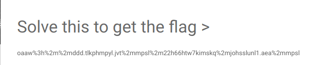

# muffinctf

## Description: 

## Difficulty: Ez

## Challenge: 
>oaaw%3h%2m%2mddd.tlkphmpyl.jvt%2mmpsl%2m22h66htw7kimskq%2mjohsslunl1.aea%2mmpsl

## Writeup:

To start with I got a string that makes nosense except it was rotated :P . So I bruteforced it and got a sense making URL looking thing at ROT-7
>http%3a%2f%2fwww.mediafire.com%2ffile%2f22a66amp7dbfldj%2fchallenge1.txt%2ffile

except it was URL-encoded .After decoding it was like this 
>http://www.mediafire.com/file/22a66amp7dbfldj/challenge1.txt/file

The link gave another file which had some BrainFucking Text (**BrainFuck**). 
>++++++++++[>+>+++>+++++++>++++++++++<<<<-]>>>>--.+++++++.+++++++++++.<<++++++++++++++++.>>--------.+++++++++++++.<<+.>>------------.++++++++.---------------..+++.+++++.-----------.+++++.-------.+++++++++++..-------.+++++++++.-------.--.

Again decoding ....
>bit.ly/muffinchallenge

Again a link . I thought Boy that's a lot of links. 
This time it's the author's blog which had many of the things **blocked**. Scrolling Down had some base32 string
>NV2WMZRRNYRXI2DJOMRWS4ZDNZXXII3UNBSSGZTMMFTQ====

which outputs to :

>muff1n#this#is#not#the#flag

A troll huh! ...again scrolling another string (very small sized) caught my eye. 
>\>F77:?LRHb2CbDb4cC&gt;JRN

Well a basic knowledge of ciphers would help u identify it. It's **ROT47** .

Last dcode ..... Phew...!

>muffin{#w3ar3s3c4rmy#}

There's our pretty FLAG.

Hope it helps.